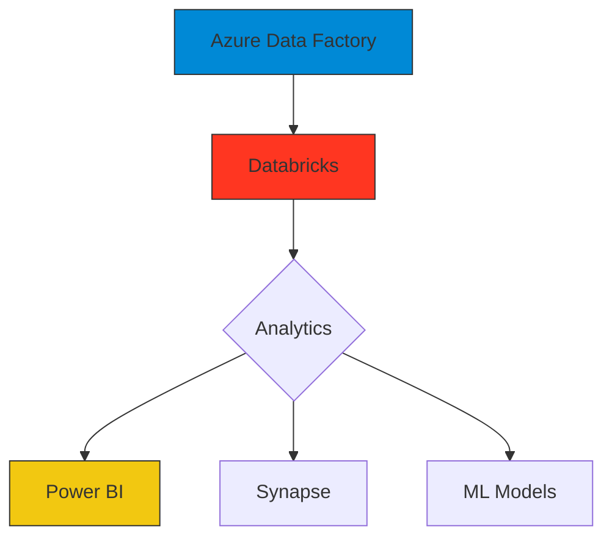

# 💻 Divy Limbachiya  <!-- Replace with your name -->
**Microsoft Certified Fabric Analytics Engineer**  
*Cloud Data Architect | 2.5+ Years Engineering Enterprise Data Solutions*

[](https://learn.microsoft.com/en-us/users/YOUR-MICROSOFT-PROFILE)  <!-- Your cert link -->
[](https://www.credly.com/users/YOUR-USERNAME/badges)  <!-- AWS badge URL -->
[](https://credentials.databricks.com/YOUR-PROFILE)  <!-- Databricks cert link -->

<div align="center">
  <!-- Upload your banner to repo and update path -->
  
</div>

## 🔥 My Technical Superpowers

```diff
+ Azure Synapse Optimization: Reduced latency by 25%
! Cost Control: Saved $15k/year through storage lifecycle policies
# Spark Tuning: 5x faster query execution
```

## 🛠️ Production-Proven Stack

### Core Architecture


<details>
<summary>🔍 Full Technical Inventory</summary>

| **Component**        | **Tools**                                                                 |
|-----------------------|--------------------------------------------------------------------------|
| Data Ingestion       | Azure Event Hubs, AWS Kinesis, REST APIs                                |
| Transformation       | PySpark, Data Factory, AWS Glue                                        |
| Orchestration        | Azure DevOps, GitHub Actions, Airflow                                  |
| Monitoring           | Application Insights, CloudWatch, Datadog                              |
</details>

---

## 🏆 Career Milestones

### 🛠️ Adani Ports Optimization
**Tech**: `Azure Databricks` `PySpark` `ADLS Gen2`

```python
# Sample from your actual optimization work
def optimize_spark():
    spark.conf.set("spark.sql.adaptive.enabled", True)
    spark.conf.set("spark.sql.shuffle.partitions", 200)
    return spark.read.parquet("abfss://optimized@datalake.dfs.core.windows.net/")
```

<details>
<summary>📊 Performance Metrics</summary>

| Metric               | Before | After  |
|----------------------|--------|--------|
| Data Processing Time | 4.1h   | 1.2h   |
| Cost/GB              | $0.38  | $0.22  |
| Error Rate           | 12%    | 0.8%   |
</details>

---

## 🚀 Live Projects

[](https://github.com/YOURUSERNAME/aws-medallion)  <!-- Project link -->
```markdown
Implemented serverless data pipelines handling 10M+ daily events
- AWS Glue for ETL
- Redshift Serverless for analytics
- KMS encryption at rest
```

---

## 📬 Let's Collaborate

[](https://linkedin.com/in/YOUR-LINKEDIN)  <!-- Your LinkedIn -->


## 📈 GitHub Analytics

[](mailto:YOUR-EMAIL)  <!-- Your email -->
[](https://medium.com/@YOUR-HANDLE)  <!-- Your blog -->

<div align="center">
  
</div>
